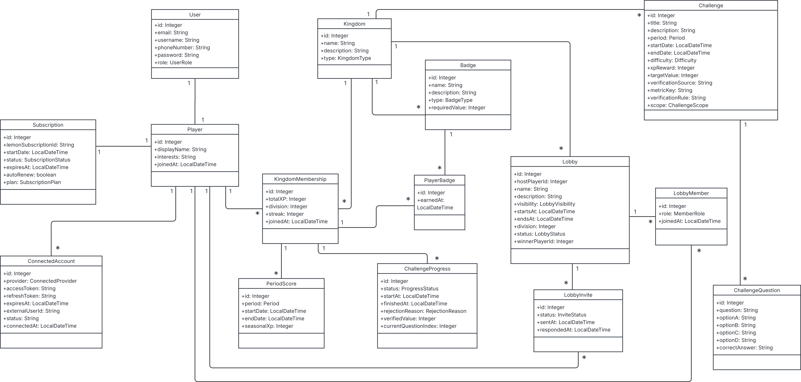
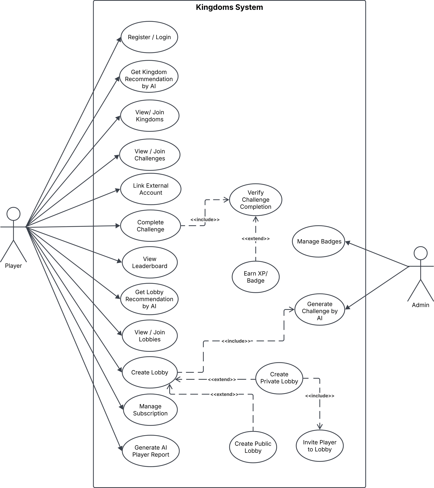

# الممالك (Kingdom) — Demo

> **تجربة تطوير ذات قائمة على التلعيب (Gamification)** — a fully **gamified**, Arabic-first self-improvement platform: join **9 kingdoms**, take on **AI-generated challenges**, **prove** them through real verification, climb **leaderboards**, earn **badges**, and **compete in lobbies**.

**🌐 Live API:** http://kingdom-env.eba-qz67sy59.eu-central-1.elasticbeanstalk.com  
**📖 API documentation:** [Postman published docs](https://documenter.getpostman.com/view/52784213/2sBXwwn7pE)  
**🎨 Design:** [Figma](https://www.figma.com/design/QUdd4Fr1vStZdvedZpRfyt/Kingdom?node-id=397-149&t=6DBbB8ELYWQBD5XK-1)

## Overview

**الممالك (Kingdom)** منصّة عربية تقوم على **التلعيب (Gamification)** لتطوير الذات بأسلوب الألعاب. ينضمّ اللاعب إلى **ممالك** متنوّعة (الرياضة، العطاء، التطوع، القراءة، الألعاب، الإسلاميات، المعرفة، التغذية، البرمجة)، ويخوض **تحدّيات يولّدها الذكاء الاصطناعي**، وعليه أن **يُثبت** إكمال كل تحدٍّ عبر تحقّق حقيقي — أنشطة Strava، أو تبرّعات بنكية عبر المصرفية المفتوحة (Neotek)، أو شهادات تطوّع يراجعها الذكاء الاصطناعي، أو اختبارات على واتساب، أو تحليل صور الوجبات، أو وقت اللعب والإنجازات على Steam، أو مساهمات GitHub. التحدّيات المُثبَتة تمنح **نقاط خبرة (XP)** ترفع **درجة اللاعب** (من D3 إلى D1) وتُكسبه **أوسمة**؛ كما **يتنافس اللاعبون في لوبيات** (يفتح اشتراك Premium عبر LemonSqueezy إنشاءها).

**الممالك (Kingdom)** is an Arabic-first, **gamified (gamification)** self-improvement platform. A player joins different **kingdoms** (Fitness, Charity, Volunteering, Reading, Gaming, Faith, Knowledge, Nutrition, Programming) and takes on **AI-generated challenges**, then has to **prove** each one through real verification — Strava activities, bank donations over Open Banking (Neotek), volunteer certificates reviewed by AI, WhatsApp quizzes, meal-photo analysis, Steam playtime & achievements, or GitHub contributions. Verified challenges grant **XP** that raises the player's **division** (D3 → D1) and earns **badges**; players also **compete in lobbies** (a Premium subscription via LemonSqueezy unlocks creating them).

## The 9 Kingdoms

| # | Kingdom | المملكة | What you do | Verified by | Tool / API |
|---|---|---|---|---|---|
| 1 | Fitness | مملكة الرياضة | Walk / run / move | Strava activities (OAuth) | **Strava** |
| 2 | Charity | مملكة العطاء | Donate to those in need | A real bank donation (Open Banking) | **Neotek** |
| 3 | Volunteering | مملكة التطوع | Community volunteering | A certificate **PDF reviewed by AI** | **OpenAI** |
| 4 | Reading | مملكة القراءة | Read books | A short **WhatsApp quiz** on the book | **Google Books** · Twilio |
| 5 | Gaming | مملكة الألعاب | Level up | Steam **playtime / achievements** | **Steam** |
| 6 | Faith | مملكة الإسلاميات | Quran & devotion | A **WhatsApp quiz** on Quran content | **Al-Quran Cloud** · Twilio |
| 7 | Knowledge | مملكة المعرفة | Learn | An **AI knowledge quiz** on WhatsApp | **OpenAI** · Twilio |
| 8 | Nutrition | مملكة التغذية | Eat well | A **meal photo analysed by AI vision** | **OpenAI (vision)** |
| 9 | Programming | مملكة البرمجة | Code | **GitHub** contributions / WakaTime time | **GitHub** · WakaTime |

## System class diagram



## Use case diagram



## AI in Kingdom

AI is the backbone of the experience, all via **OpenAI (gpt-5.5)** with strict JSON output:
- **Challenge generation** — a per-kingdom AI service generates each challenge (difficulty + period aware), de-duplicated against the kingdom's existing titles, with a **deterministic fallback** so the flow never breaks when the model is off. XP is always assigned by our code, never the model.
- **Kingdom recommendation** — matches a player's interests to the kingdom that fits best.
- **AI player report** — builds a personalised performance report and emails it.
- **Verification AI** — reviews the **volunteer certificate PDF** (semantic match) and analyses the **nutrition meal photo** (vision); generates the **Reading / Faith / Knowledge** quizzes delivered over WhatsApp.

## Main endpoints

Base URL `http://localhost:8080/api/v1` (or the live deployment). Auth is HTTP Basic; 🔒 = admin-only. Full interactive reference in the **[Postman docs](https://documenter.getpostman.com/view/52784213/2sBXwwn7pE)**.

### Auth & onboarding — `/auth`
| Method | Path | What it does |
| --- | --- | --- |
| POST | `/auth/register` | Create account (User + Player + memberships) and send the WhatsApp OTP. |
| POST | `/auth/send-otp` | Resend the verification code. |
| POST | `/auth/verify-otp?code=` | Verify the phone and activate the account. |

### Kingdoms & membership — `/kingdom` · `/kingdom-membership`
| Method | Path | What it does |
| --- | --- | --- |
| GET | `/kingdom/get` | List the 9 kingdoms. |
| POST | `/kingdom/ai-recommendation` | **AI** recommends a kingdom from the player's interests. |
| POST | `/kingdom-membership/join/{kingdomId}` | Join a kingdom. |
| DELETE | `/kingdom-membership/leave/{kingdomId}` | Leave a kingdom. |
| GET | `/kingdom-membership/{kingdomId}/member-xp` · `/member-streak` · `/member-divison` · `/member-rank` · `/division-progress` | The player's standing in a kingdom. |
| GET | `/kingdom/{kingdomId}/leaderboard/division/{division}` | Leaderboard by division. |
| GET | `/kingdom/{kingdomId}/leaderboard/period/{period}` | Leaderboard by time (daily/weekly/monthly). |
| GET | `/kingdom/{kingdomId}/leaderboard/period/{period}/division/{division}` | Leaderboard by time **and** division. |

### Challenges — `/challenge` · `/challenge-progress`
| Method | Path | What it does |
| --- | --- | --- |
| GET | `/challenge/kingdom/{kingdomId}` | Browse a kingdom's challenges. |
| GET | `/challenge/difficulty/{difficulty}` · `/challenge/period/{period}` | Filter by difficulty / period. |
| POST | `/challenge/generate?kingdomId&difficulty&period` | 🔒 **AI** generates + saves a new challenge. |
| POST | `/challenge-progress/join/{challengeId}` | Start a challenge run. |
| POST | `/challenge-progress/finish/{id}` | Finish → routes to the kingdom's verification engine. |
| POST | `/challenge-progress/cancel/{id}` | Cancel a run. |
| GET | `/challenge-progress/player/active` · `/player/status/{status}` | The player's active / by-status runs. |

### Verification (per kingdom) — `/verify` · `/challenge-progress`
| Method | Path | Kingdom |
| --- | --- | --- |
| GET | `/verify/fitness/connect` · `/callback` · `/activities` · `/check` | **Fitness** — Strava OAuth + activity check. |
| POST | `/verify/charity/link` · `/donate` · `/manual-donate/...` ; GET `/charity/check` | **Charity** — Neotek bank consent + donation check. |
| POST | `/verify/volunteer/upload` | **Volunteering** — AI-reviewed certificate PDF. |
| POST | `/challenge-progress/submit-image/{progressId}` | **Nutrition** — AI meal-photo analysis. |
| POST | `/challenge-progress/submit-github/{membershipId}/{challengeId}` | **Programming** — GitHub repo submission. |
| POST | `/challenge-question/whatsapp/webhook` | **Reading / Faith / Knowledge** — WhatsApp quiz answers. |
| POST | `/verify/streak/run` · `/streak/warn/{playerId}/{kingdomId}` | 🔒 Daily streak keeper. |

### Lobbies — `/lobby` · `/lobby-member` · `/invite` · `/lobby-challenge`
| Method | Path | What it does |
| --- | --- | --- |
| POST | `/lobby/create/{kingdomId}/{challengeId}` | Create a competition lobby (Premium). |
| GET | `/lobby/public/{kingdomId}` · `/lobby/my` · `/lobby/suggest` | Browse / mine / **AI** suggestion. |
| POST | `/lobby-member/join/{lobbyId}` · `/join-private/{inviteCode}` | Join public / private (by invite code). |
| GET | `/lobby-member/members/{lobbyId}` | Who's in the lobby. |
| POST | `/invite/send/{lobbyId}/{username}` · `/invite/resend/{id}` ; PUT `/invite/reject/{id}` | Invite over WhatsApp / respond. |
| POST | `/lobby-challenge/resolve/{lobbyId}` | Resolve — first to finish & verify wins, players notified. |
| POST | `/lobby/finish/{lobbyId}/{winnerPlayerId}` | Host closes + awards a winner. |

### Profile, badges & leaderboards — `/player` · `/player-badge`
| Method | Path | What it does |
| --- | --- | --- |
| GET | `/player/me` · `/player/summary` · `/player/best-kingdom` · `/player/kingdoms` · `/player/highest-streak` | Profile + stats. |
| POST | `/player/ai-report` | **AI** performance report, emailed. |
| GET | `/player-badge/player-badges` · `/player-badge/{kingdomId}/member-badges` | Earned badges (all / per kingdom). |

### Premium & payments — `/payment` · `/subscription`
| Method | Path | What it does |
| --- | --- | --- |
| GET | `/payment/plans` ; POST `/payment/checkout/{plan}` · `/renew/{plan}` · `/webhook` | LemonSqueezy plans / checkout / renew / webhook. |
| GET | `/subscription/am-i-premium` · `/days-left` ; POST `/subscription/cancel` | Premium status / cancel. |

### Admin & n8n automation — `/user` · `/n8n` + feeds
| Method | Path | What it does |
| --- | --- | --- |
| GET | `/user/statistics` · `/user/players` · `/user/challenge-progress/pending` | 🔒 Admin dashboard + review queue. |
| PUT | `/user/player/{playerId}/ban` · `/unban` · `/membership/{id}/adjust-xp/{xp}` | 🔒 Moderation. |
| POST | `/n8n/test` | 🔒 Fire the n8n webhook to verify the pipe. |
| GET | `/subscription/subscriptions-expiring` · `/player/churn-risk` · `/player/weekly-reports` · `/lobby/winners` | 🔒 Feeds **n8n** pulls to push WhatsApp/email. |

## Tools & APIs used

| Area | Tech / Service |
| --- | --- |
| **Core** | Java 17 · Spring Boot 4.0.6 · Spring Web · Spring Data JPA (Hibernate) · Spring Security (HTTP Basic + BCrypt) · MySQL · Lombok · Maven |
| **AI** | OpenAI **gpt-5.5** (Responses API, strict JSON) — generation, recommendation, report, PDF & image verification, quizzes |
| **Messaging** | Twilio (WhatsApp) · Mailtrap (email) |
| **Fitness** | Strava API (OAuth) |
| **Charity** | Neotek **Open Banking** (account consent + transactions) |
| **Gaming** | Steam Web API (playtime + achievements) |
| **Reading** | Google Books API |
| **Faith** | Al-Quran Cloud API · Quran Tafsir API |
| **Programming** | GitHub API · WakaTime |
| **Payments** | LemonSqueezy |
| **Automation** | n8n (pull-based feeds → WhatsApp/email) |
| **Deployment** | AWS Elastic Beanstalk + RDS MySQL |

## Tech stack at a glance

Java 17 · Spring Boot 4.0.6 · MySQL · OpenAI (gpt-5.5) · Twilio · Mailtrap · Strava · Neotek · Steam · Google Books · Al-Quran Cloud · GitHub · WakaTime · LemonSqueezy · n8n · AWS.

## Run it

```bash
# MySQL running locally with a database named `Data`, then:
mvn spring-boot:run
```

- Base URL: `http://localhost:8080/api/v1`
- Provide secrets as env vars (or a git-ignored `src/main/resources/application-local.properties`): `OPENAI_API_KEY`, `TWILIO_*`, `MAILTRAP_API_TOKEN`, `STRAVA_*`, `NEOTEK_*`, `STEAM_*`, `GOOGLE_BOOKS_*`, `GITHUB_*`, `LEMON_*`, `N8N_WEBHOOK_URL`.
- A ready Postman flow is included: **`Demo-Ar.postman_collection.json`** (all 9 kingdoms → lobby → profile, in Arabic).

## Team

Project By **Anas**

